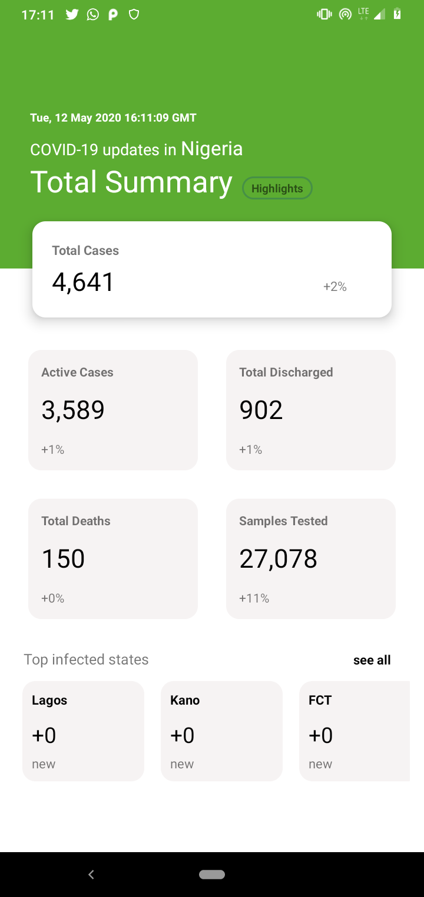

# COVID-19 NCDC Aid Mobile

Android application to easily give updates on the number provided by NCDC and some little help to staying safe with the data gotten from the NCDC website based on the developed flask python API by [devcyclops](https//:github.com/devcyclops)

Current Screens
-------------

 

