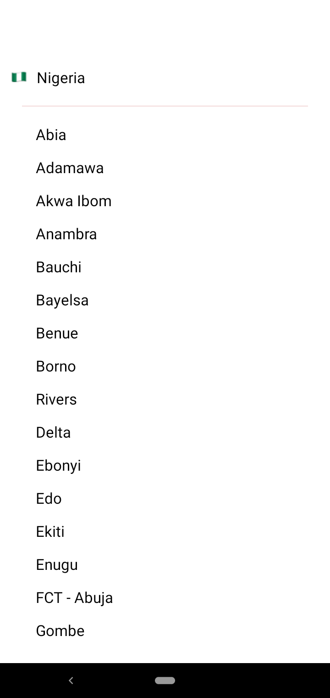
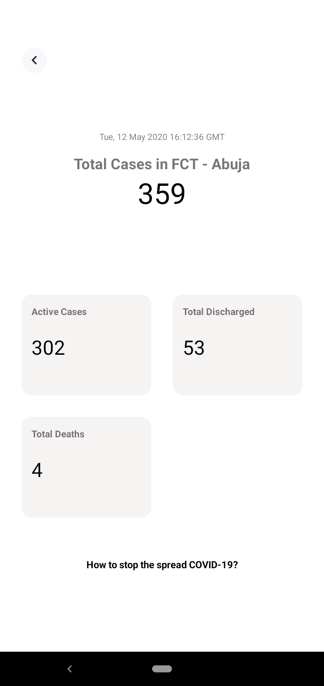
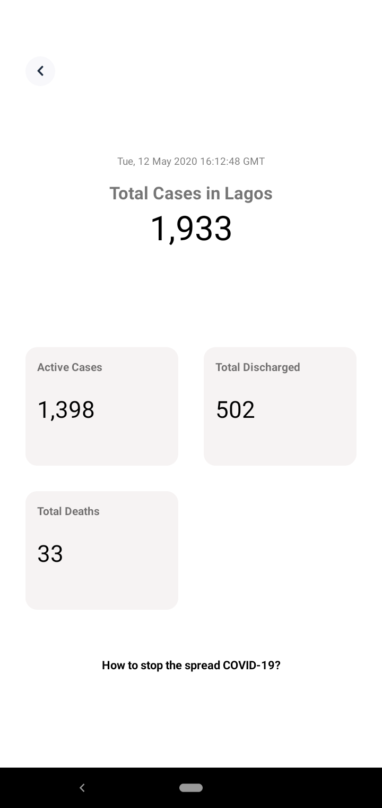

# COVID-19 NCDC Aid Mobile

Android application that easily gives updates on the numbers provided by NCDC concerning the COVID-19 Virus happenings in Nigeria and some little help to staying safe. All developed around the flask python scrapping API by [devcyclops](https://github.com/devcyclops) and some images from [NCDC Twitter](https://twitter.com/NCDCgov) account and [WHO website](https://www.who.int/).

Current Screens
-------------

 
 

